## Project Overview

### Project name

  

# Bruno

### Team members 

| 
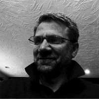
 [James Sheeder](https://www.linkedin.com/in/james-sheeder-1282a8156) Founder at BRUNO | 
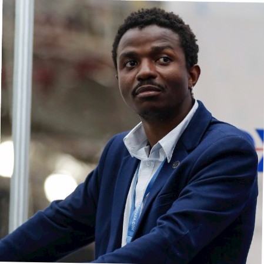
 [Taylor Bingwa](https://www.linkedin.com/in/taylorbingwa/) Head of Sales at Qoden | 
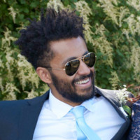
[Albert Tackie](https://www.linkedin.com/in/albert-tackie/) Software Engineer & Co-Founder at BRUNO | 
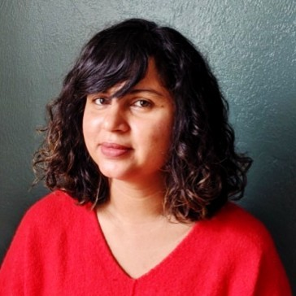
[Anjali Tomer](https://www.linkedin.com/in/anjalitomer/) Senior Product Manager at Zest Al |
| :---: | :---: | :---: | :---: |
| 
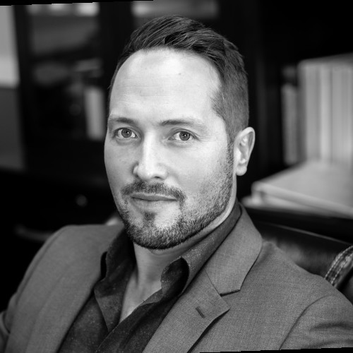
[Matt Kaufman](https://www.linkedin.com/in/matt-kaufman-7972b567/) Attorney at Hathaway & Kunz, Wyoming Blockchain Taskforce | 
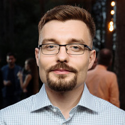
[Andrey Verbin](https://www.linkedin.com/in/andrey-verbin-1a40568/) Co-Founder at Qoden | 
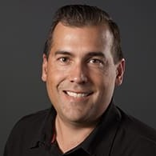
[Tim Leonhardt](https://www.linkedin.com/in/timleonhardt/) Leonhardt Senior Product Manager at LexisNexis Risk Solutions | 
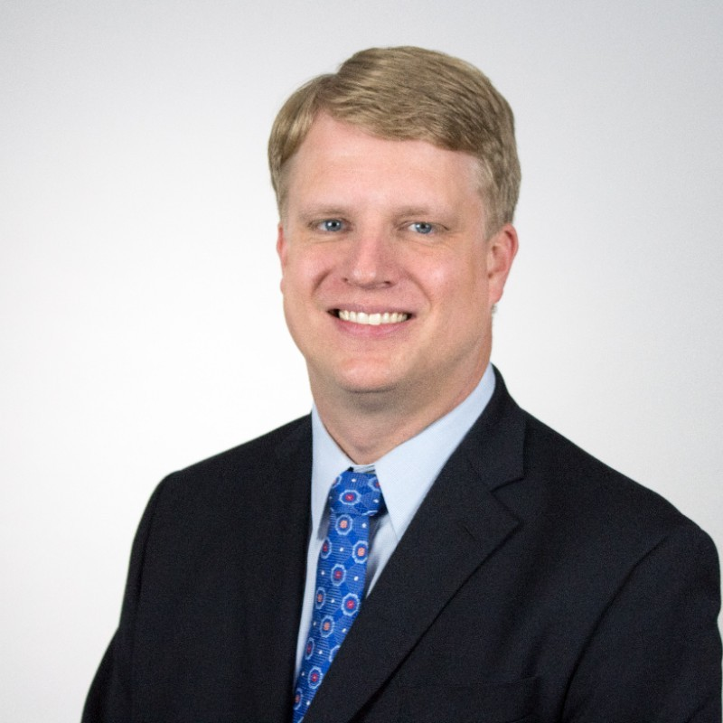
[Jamey Noland](https://www.linkedin.com/in/jamey-noIand-86978958/) Director at PenTrust Inc. |
| 
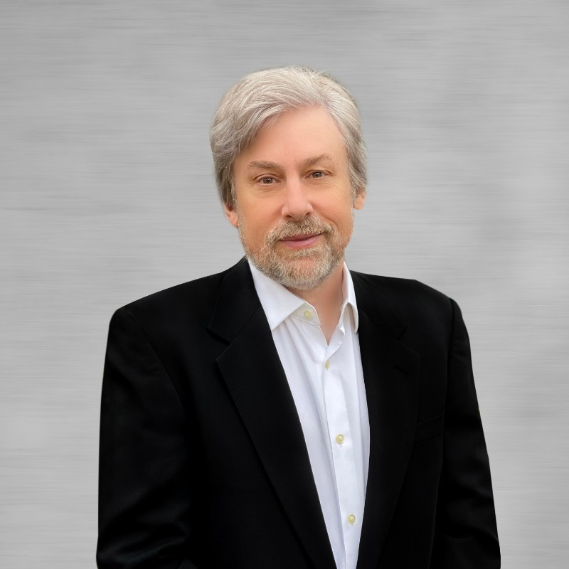
[Mark Roderick](https://www.linkedin.com/in/markroderick/) Principal Partner at Lex Nova Law LLC | 
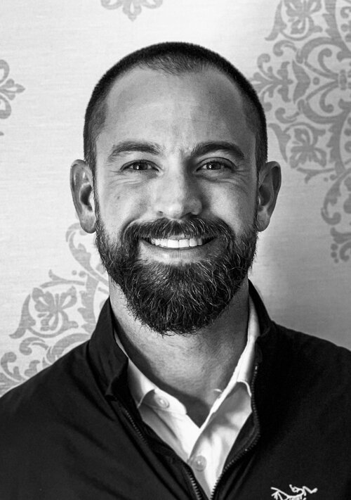
[Mark Regan](https://www.linkedin.com/in/iworktoski) Partner at Grit Ventures | 

[Ashley Frederick](https://www.linkedin.com/in/ashley-frederick-0b5a53142/) Frederick Design |  |

### What project are you building 
> The first Ethereum-based investment engine.
### Why did you decide to build it 
> It is our thesis that Ethereum is a social capital platform designed to transmit value. Our registered investment advisor will utilize Ethereum as a platform to create fund structures.
### How long will it take 
> 4-8 weeks
### How much funding are you requesting  
> $50,000
### How did you hear about the GECO
> We became familiar with Gnosis/GECO from Bankless whom we follow on Twitter and other platforms.

## Your Proposal 
### Project description

"BRO" is a symbol for the brand BRUNO which will provide advisory services, fund management, and possibly digital life and annuity products. It will represent ownership in the General Partner as a governance token of a large fund structure. These initial funds will include: a "Mothership" investing in the Ethereum ecosystem as well as a series of Ethereum 2.0 staking pools. This will create the core fund structures for a more expanded social capital engine.

### Features

The governance token "BRO" will be an ERC20 structure to be issued in conjunction with Gnosis and related entities. We have reviewed the technology and structures of other Ethereum related offering platforms and believe that Gnosis is best of breed. Issues of compliance regulation, security, and liquidity are absolutely critical to a Registered Investment Advisor as we try to merge digital operations with existing regulatory structures to create large semi-autonomous funds. Once these issues are successfully dealt with, the Ethereum ecosystem can grow by orders of magnitude. The Multisig security technology will provide the missing link for the issuance of "BRO" and other tokenized fund structures. The creation of professionally managed fund structures operating on the Ethereum blockchain as the settlement layer should not require third party control, and your security and issuance solutions will help us meet these challenges.

### Team description

Mr. Sheeder, the founder of BRUNO, has been a Broker and Registered Investment Advisor for over 20 years in Investment Banking, Executive Benefits, and Private Placements. He has operated with JOBS Act regulation since 2014 with transactions including fund structure, Real Estate, and Early Stage Capital.

Mr. Tackie is the co-founder of BRUNO & has been operating as a developer in the Healthcare space for nearly a decade. He has worked with the Founder on and off since 2011. Mr. Tackie is currently focusing on the issues of security, custody, and liquidity in the Ethereum ecosystem.

Ms. Frederick has a degree in Family Business and specializes in state-of-the art design, publishing, and digital marketing. She is currently studying Ethereum protocol as the basis for Web 3.0. Other team members have deep experience in Venture Capital, Real Estate, Pension Management, Software Development, as well as Law and Securities Regulation.

### Timeline, Milestones and Deliverables

**Phase I**

Will focus on regulation and security. This will include "What is a true governance and utility token? How can this be used for voting and semi-autonomous organizations?"

**Deliverables**

The creation of a one or more opinion letters by legal counsel with deep knowledge of digital asset issuance in partnership with Gnosis and related entities.

**Time and Price Estimate**

$15,000, 2-4 weeks

**Phase II**

This stage will focus on tokenization using the ERC20 protocol with Ethereum as the settlement layer while operating with other technology and media partners.

**Deliverables**

The ERC20 token "BRO".

**Time and Price Estimate**

$15,000, 8-10 weeks

**Phase III**

This will be the creation of Multisig wallets and trading on Mesa DEX.

**Deliverables**

The creation of the multisig wallet.

**Time and Price Estimate**

$10,000, 4-6 weeks

### Others	 

From the token "BRO" representing ownership in the General Partner, BRUNO Capital will be created, an Investment Advisor managing pooled investments in an underlying fund structure operating as a series or sometimes called "Hub and Spoke" structure. This can allow for an expansion of new fund structures with various themes from crypto to the environment, social, and governance (ESG) while at the same time simplifying legal structure, regulatory compliance, and the technology upon which they settle. Ethereum has forever changed the way capital will be raised, from its own initial offering, now to be replicated by other structures, while at the same time in compliance with existing regulation.

BRUNO LLC  
Allocations by Group  
$10 million valuation  
40 million shares offered at $.10

  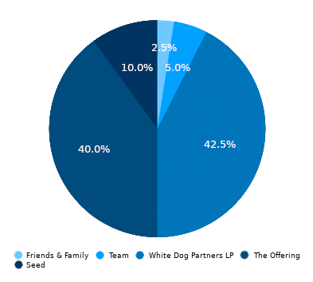

Who was [BRUNO](https://www.thoughtco.com/giordano-bruno-3071094)?:
 "The universe is one, infinite, immobile...
It is not capable of comprehension and therefore is endless and limitless"

  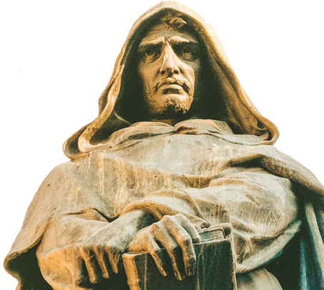

  Copyright © 2021 BRUNO. All rights reserved.

