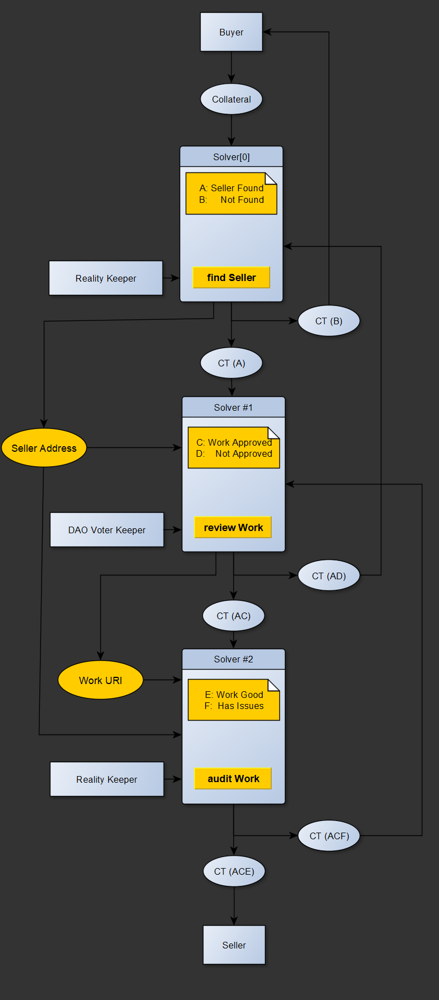

# Project Overview

## Project name

Cambrian Protocol

## Team members

Nicholas Wickman - https://www.linkedin.com/in/nicholaswickman/ | https://github.com/NicWickman

Paul Malin - https://www.linkedin.com/in/pmalin/

Oliver Hens - https://www.linkedin.com/in/oliver-hens/

Ryan Walker - https://github.com/machine-hum

## What project are you building

A system of extensible, modular smart contracts and associated UIs called "_Solvers_" which utilize the Conditional Tokens Framework and are no-code composable into bespoke business solutions for decentralized organizations. Additionally, a curative staking scheme and user-facing platform to incentivize the large-scale community development and adoption of solutions utilizing the CTF, Gnosis Safe, Zodiac modules and other related DAO technologies.

## Why did you decide to build it

Our vision is of a halcyon future where global labor and services markets will move on-chain in the form of remote workers, blockchain-exposed centralized companies and decentralized organizations all working and transacting together. However, the space of unique business applications to be assimilated by smart contract technology is nearly as vast as the traditional labor and services economy as a whole. The need for highly specialized software development talent in creating new smart contract solutions is a severely limiting factor for converting a web2-enabled economy to web3.

We believe that by democratizing the creation of new on-chain business solutions beyond engineering talent, we can greatly increase the speed and scope of smart contract adoption across industries.

## How long will it take

Our roadmap through to the launch of our staked/curated solutions marketplace is expected to take us 6 months into April.

## How much funding are you requesting

$89,500

## How did you hear about the GECO

gnosis.io

# Your Proposal

## Project description

Our project seeks to build foundational legos ("_Solvers_") system for composing novel goods, labor and service solutions which can be used by non-developers. It also seeks to develop a crypto-economic incentive model to attract developers to the creation of new Solvers and introduction of additional utility to the system. Developers are rewarded with a small fee from funds which flow through their Solvers, incentivizing development of those with valuable general-purpose functionality or which capture profitable niches. We are also building a staking scheme to curate and signal high-value Solvers and Solutions in a marketplace, allowing third parties to easily select the best tools for their needs.

Solver implementations are instantiated as proxy contracts with custom parameters for instances of a project, which may be to:

• Hire freelancers for a work
• Enter mutual funding agreements with other organizations
• Administer grants programs and public goods funding
• Sell labor and services on-chain
• Accountably allocate resources within decentralized organizations
• Run contests and lotteries
• Conditionally incentivize delegates and other entities
• . . .and much more!

A Solver instance uses the Conditional Token Framework to manage escrow for a discrete part of a Solution, a chain of Solvers deployed with some configuration for an instance of work, and provide unique utility for the administration of that part. A Solver instance manages a canonical CTF condition and splits a position, distributes conditional tokens to recipients including other Solvers, then runs its unique functions and can receive calls and pass data to other Solvers. It takes as parameters a `keeper` and optional `arbitrator` address (among others) which are authorized to stage and confirm CTF payout reports. We imagine these addresses will often be Gnosis Safes with their own access controls.

### Solvers Illustrative Example

A DAO intrapreneur has identified a need for a new smart contract that would create value. Through our no-code platform, they create and pin to IPFS the execution parameters and descriptive terms of a _Solution_ they believe will be amenable to the DAO. These parameters are made into a proposal with a funding goal. When funded, the Solution is deployed from the hash-checked parameters of the proposal.

The DAO funds the proposal to deploy a three-Solver Solution separately managing the tasks of:

1. Selecting a developer — _Solver[0]_
2. Approving the work — _Solver[1]_
3. Passing a security audit — _Solver[2]_

_Solver[0]_ implements a prediction market, open only to the DAOs members, to select the developer from a list of applicants after some period. It splits a position of **_CT(A)("Successfully Chose a Developer")_** and **_CT(B)("Failed to Choose")_**. **_CT(A)_** is sent to _Solver[1]_, and **_CT(B)_** is returned to the DAO for redemption in the event that a developer cannot be found. Its `Keeper` is a Gnosis Safe with the Zodiac Reality module which reports **_(A)_** only if the winning developer's tokens are trading above a certain price.

_Solver[1]_ provides an interface for the developer to submit work for review. It splits **_CT(AC)("Work Completed")_** and **_CT(AD)("Not Completed")_**. **_CT(AC)_** is sent to _Solver[2]_. **_CT(AD)_** is sent back to _Solver[0]_, allowing for reselection of a developer if the first choice fails to complete work by re-splitting a new position to be cascaded down-chain. Its `Keeper` is a Gnosis Safe with the multisig held by the DAO members reviewing the work.

_Solver[2]_ splits **_CT(ACE)("Work is Good")_** and **_CT(ACF)("Issues to be Addressed")_** and submits a URI of the approved work from _Solver[1]_ for an audit along with some CTs from both outcome collections as payment. The remaining **_CT(ACE)_** is distributed to the developer chosen by _Solver[0]_. **_CT(ACF)_** is sent back to _Solver[1]_ to repeat the process if the audit shows improvements are needed. The `Keeper` is a Gnosis Safe with the Zodiac Reality module reporting on the audit results.

Finally, when the happy path of **_CT(ACE)("Successfully Chose a Developer, Work Completed, Work is Good")_** is true, the solution is finished and any remaining conditional tokens are redeemable.

A template of this solution is saved and can be used again with minimal configuration.

## Outlook

Our immediate roadmap aims to develop a core set of Solvers for general purpose use, a DAO-friendly proposal system, and the crypto-economic incentive model to promote further development. We are founding CambrianDAO to "dog-food" these solutions and create a community for entrepreneurs and developers to work together to capture new markets on-chain.

## Why Fund This?

We are pushing the applications of Gnosis tech! We believe Solvers harness the potential of Conditional Tokens as a broadly "event-based digital asset class" in previously unrealized ways. Gnosis Safe serves as the basic primitive for DAOs to operate as the Keepers and Arbitrators of these solutions. We're building a flexible, scalable framework for administering labor and services on-chain which centers directly on the Gnosis stack.

## Team description

**Nic Wickman** is a devout futurist hailing from the intersection of art and technology in VFX. His trajectory has seen him lead VFX teams on award-winning projects, develop VR for the real estate space, publish consumer apps, and design and deploy novel AI into production. More builder than speculator, he came to appreciate the potential of blockchain as the Ethereum ecosystem flourished.

**Paul Malin** is an entrepreneur with multiple exits under his belt. His career has focused on accounts, strategic alliances, sales and other business development efforts. He discovered Bitcoin at $70 and is dutifully obsessed with the potential of blockchain technology to create an internet of value. He spent his 20s in a rock band, holds an MBA from the University Toronto, and a BSc in Chemistry from the University of Alberta.

**Oliver Hens** is an experienced UX developer, entrepreneur and part-time digital nomad. His experience ranges from software engineering at MIPS in Germany to running a photography and film-making business in Panama. He discovered the potential of blockchain technology recently and has taken the plunge with Cambrian to build the future of work.

**Ryan Walker** studied robotics and electrical engineering in college while maintaining a key interest in emerging technologies. He’s an industry professional of 10 years with a formidable side-project portfolio, including the blockchain-based MMO ecosystem “Worlds”, which allows digital assets to be transferred between several independently developed games. Outside of his collaboration with the Cambrian team, he develops for Oculus on cutting-edge Augmented Reality technologies.

## Timeline, Milestones and Deliverables

_Some aspects of our roadmap that have already received funding are not included here._

1. Basic proof-of-concept Solver and Proposal contracts - **DONE!**

2. UI + Safe App for composing solutions, creating proposals and administering active solutions – _Q1 2021_ - est. **$12,500**

3. Safe-friendly smart contracts/UI supporting atomic revisions to proposed solutions – _Q1 2021_ - est. **$10,000**

4. Support for deploying new Gnosis Safes as part of a Solution's configuration - *Q1 202*2 - est. **$15,000**

5. A general-purpose Solver implementing a prediction market for making a selection from a set of candidate options - _Q1 2022_ - est. **$20,000**

6. A prudent security audit for our integrated Gnosis Safe deployment and prediction market Solver - _Q1 2022_ - est. **$7,000**

7. The fee-taking and curative staking system + UIs to drive development and adoption of a solutions marketplace - _Q2 2022_ - est. **$25,000**

## Others

We are an infant Startup aligned with and building heavily on the Gnosis tech stack. We actively welcome any further partnerships or cooperative arrangements.
