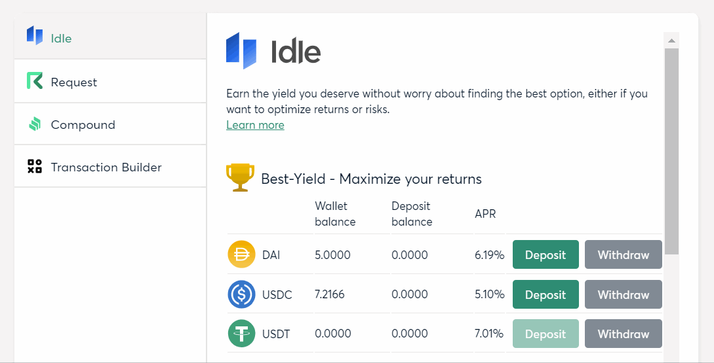
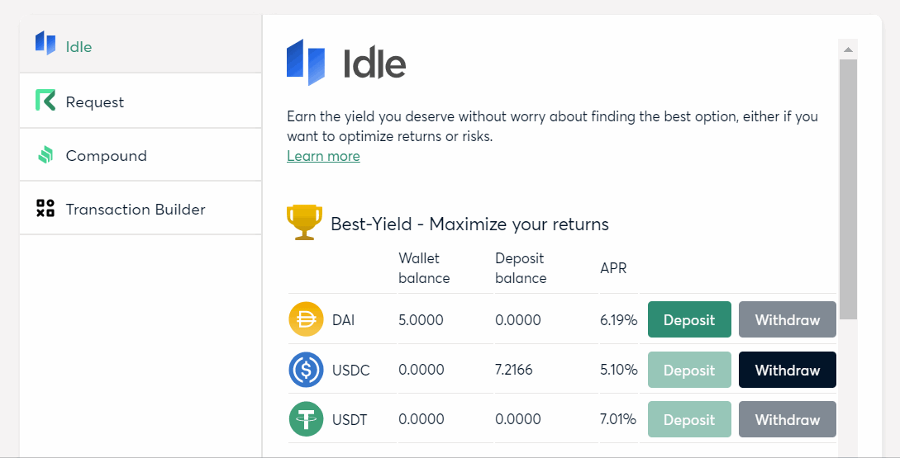

## Project Overview

[Idle finance](https://idle.finance/#/) is a loan yield optimizer that automatically rebalances your deposit to the best yielding protocol. The team behind it has just released v3 of their product, integrating five different interest-earning protocols: Compund, Fulcrum, Aave, Day Savings Rate, and dYdX. It works with popular stable coins: DAI, USDC, and USDT. It offers two yielding strategies, Best Yield and Risk-Adjusted.

### Project name

Idle Finance

### Team members

Kris Urbas [@krzysu](https://twitter.com/krzysu) krzysu[at]interia.pl

I'm an independent software developer, I'm not related to the team behind Idle, but I have some experience with their smart contracts and frontend. I have more than 10 years of experience building web applications, mainly as a Frontend Engineer.

### What project are you building

I want to provide similar features to Gnosis Safe users, as you can see on the Idle website.

### Features

- deposit supported stable coins (DAI, USDC, USDT) to Idle contracts, receive Idle tokens
- redeem Idle tokens for underlaying stable coins
- see basic stats, like current APR and amount deposited

I will use the same technology as the existing Safe Apps. I want to follow the same patterns as found in [Safe Apps repository](https://github.com/gnosis/safe-react-apps).

### Why did you decide to build it

I use Idle for my personal finance and I believe Idle makes it easier to earn a yield on your savings than manually rebalancing your funds to different lending protocols.

### How long will it take

I estimate it for 5-7 working days.

### How much funding are you requesting

Medium complexity: \$1,500

### How did you hear about the GECO

I think I've first read about Gnosis Apps on Reddit

### Timeline, Milestones and Deliverables

I will deliver the app until the end of June.

## Update 16.06.2020

### Link to the open-source repository

The source code of the Safe App is available here: [https://github.com/krzysu/safe-app-idle](https://github.com/krzysu/safe-app-idle)

The app is interacting with Idle V3 smart contracts on mainnet. Source code of the contracts is available here: [https://github.com/bugduino/idle-contracts](https://github.com/bugduino/idle-contracts). More details can be found in [Idle docs](https://developers.idle.finance/contracts-and-codebase).

### Walkthrough screencast

#### Deposit

#### Withdraw

## Update 23.06.2020 - final version

### Links to a hosted version of the Safe App

- Fleek: [https://gnosis-safe-idle-app.on.fleek.co/](https://gnosis-safe-idle-app.on.fleek.co/)
- IPFS hash: [QmVHo99ojWo6vidTbwMbzws8xGheFtBYPXxJk4ox1unqGP](https://ipfs.fleek.co/ipfs/QmVHo99ojWo6vidTbwMbzws8xGheFtBYPXxJk4ox1unqGP/)
