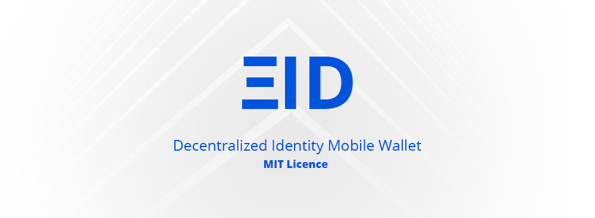
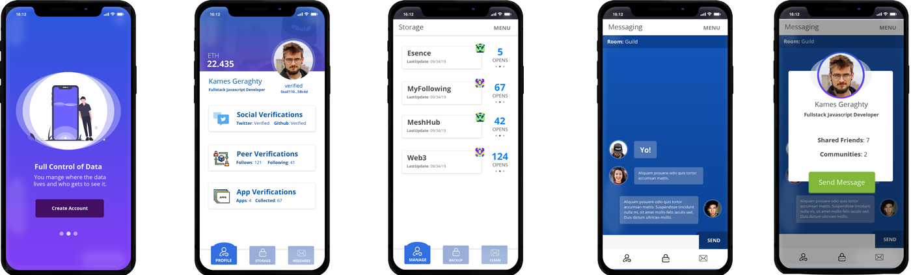
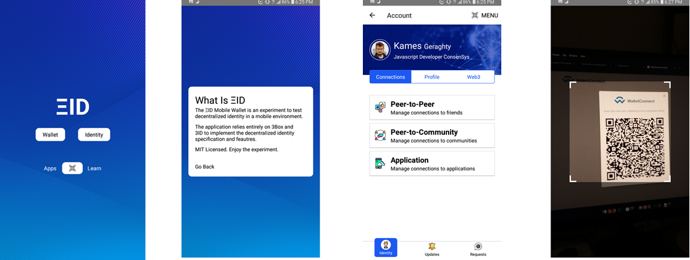

# Microgrant Application

### Dapp name

ETHId Mobile

https://github.com/KamesCG/ethid-mobile

### Team members

It's currently just me scaffolding the MIT Open Source Decentralized Identity Wallet, but I am communicating with the 3Box team and also hope to help MetaMask backport any useful identity features.

### GitHub Repo

https://github.com/KamesCG/ethid-mobile

### What is your Dapp about?

The current objective of the EthID Mobile Project is to help facilitate the integration of WalletConnect and 3Box.

With the new 3ID Identity specification outlined by 3Box it's possible to now manage spaces around smart contract wallets.

Why is this important?

**Because Gnosis wallets are all about multiple signatures and in effect multiple wallets.**

Thus the 3ID specification and GnosisSafe are a perfect combination for managing both on-chain and off-chain simultaneously via this multi-signature and authentication method. A team can manage funds on-chain and also manage a decentralized identity off-chain. It's a perfect combination, because of the seperation of concerns and composability.

contract wallet space: https://github.com/3box/identity-wallet-js#creating-an-identity-for-a-contract-wallet

authenticate: https://docs.3box.io/identitywallet-api/index#identitywallet-authenticate-spaces-opts

addAuthMethod: https://docs.3box.io/identitywallet-api/index#identitywallet-addauthmethod-authsecret

#### Mobile Wallet Presentation on 3Box Community Call

In summary by adding `GnosisSafe` smart contract deploy capabilities within the React Native application (even just for demonstration purposes) AND including the 3Box `identity-wallet` features, it will give mobile wallets the ability to cross-authenticate and share a decentralized identity if the need arises.

Wallet A can login to Wallet B via the 3ID wallet specification and share a decentralized identity space together.

This is good, because it will enable Open Source projects that raise funds in a GnosisSafe and also have a flexible decentralized identity, so as the team evolves new members can be granted/revoked privileges.

### Why did you decide to build it?

I want the ecosystem to have a really great MIT Open Source License Decentralized Identity Wallet. An Open Source decentralized identity wallet is an important ecosystem stepping-stone IMO. Why not Gnosis and 3Box?!?

### How big is your user base?

My user base? None. But I think the motivation behind the wallet is to let other projects (maybe MetaMask mobile) easily tap into team management interfaces, which also incorporate decentralized and verifiable credentials as an additional authentication layer on top of the Gnosis Safe wallet.

By connecting both on-chain team management and off-chain team management features into a unified interface/experience I think it would benefit greatly both the Gnosis and 3Box teams, and more importantly the larger Ethereum ecosystem, because high-order team thinking is required to achieve sich large dreams and aspirations 🦄🌈🦄🌈 such as DAOs, banking for the unbanked, and the many other complex organizational tasks that is being planned for the Ethereum blockchain.

### How long will you need to integrate a Gnosis Safe compatible WalletConnect integration?

I think a couple solid weekends of hacking should get the job done.

The `WalletConnect` and `identity-wallet` are already integrated into the React Native application. So now it's simply of adding the correct deploy method for a `GnosisSafe` smart contract and including the ability to `authenticate` smart contract wallets via the new 3ID specification.

### Does your Dapp use message signing?

The Smartphone Application Boilerplate is agnostic on the user experience implementation of transactions and/or signatures. The objective is to build a library integrating `GnosisSafe` with a decentralized identity system. It will probably include and require a number of different authenticate methods to be feature complete.

Right now the Mobile Wallet can pass any of the standard (and non-standard) JSON-RPC calls required to facilitate a `GnosisSafe` integration.

### How did you hear about the GECO?

Twitter

### Others

Open Source the World
